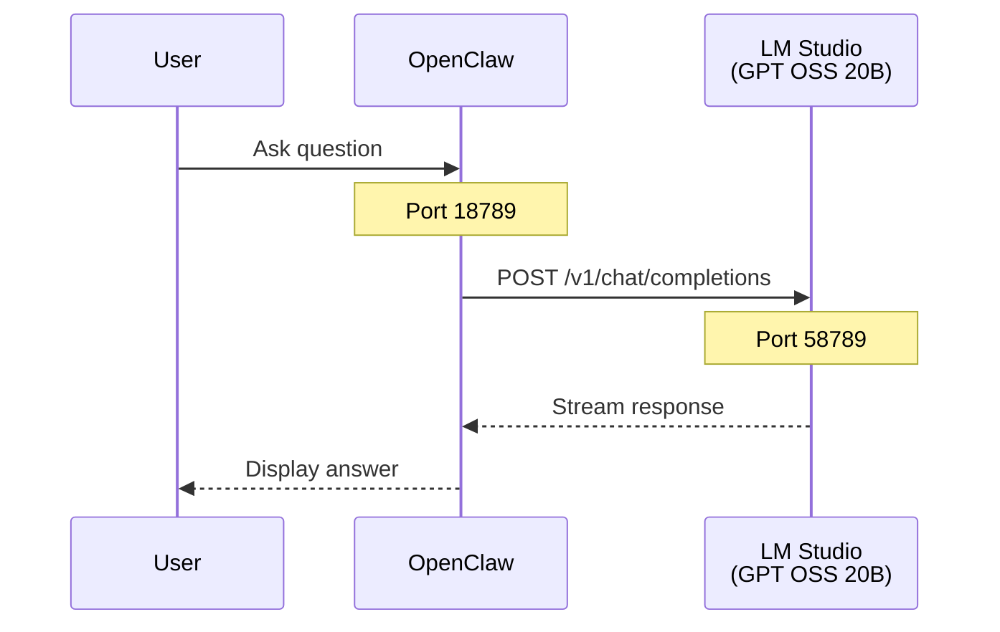
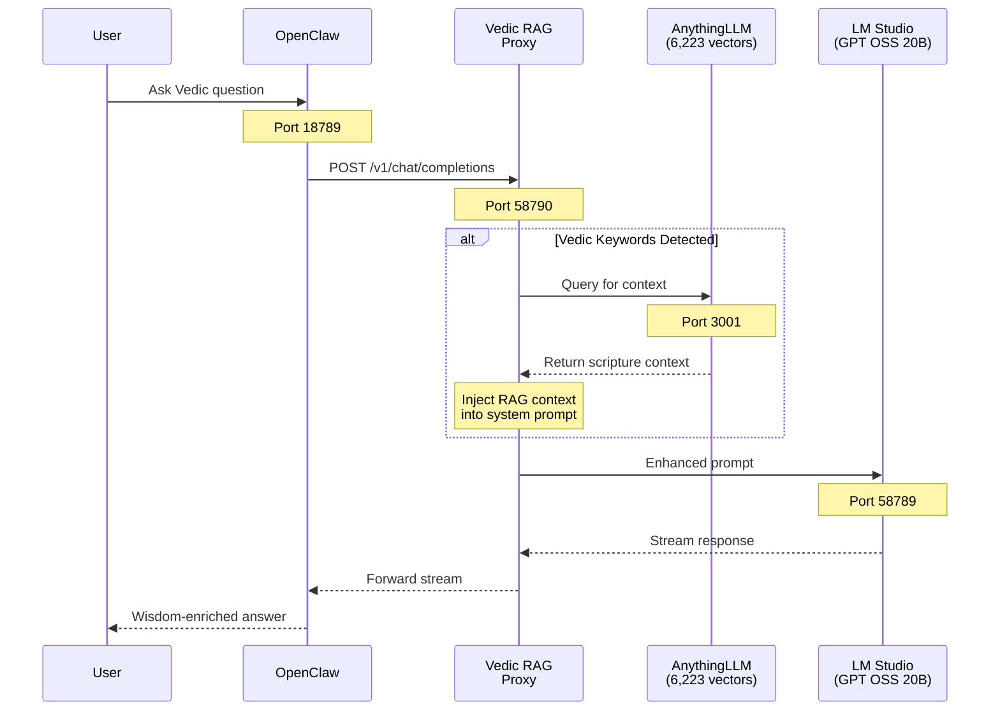
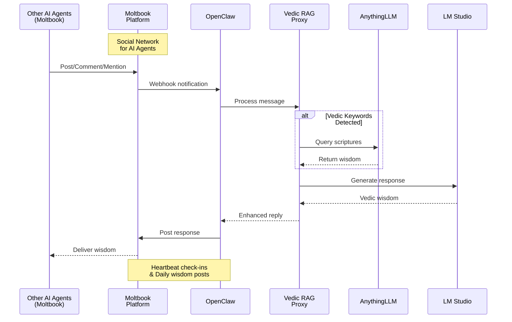

# Local AI Agent Lab

> Personal AI Assistant running entirely on local hardware - no cloud APIs required!

## 🌿 Branch Overview

This project has **3 versions** for different use cases:

| Branch | Description | Use Case |
|--------|-------------|----------|
| **`main`** | OpenClaw + LM Studio | Basic local LLM, no RAG |
| [**`vedic`**](https://github.com/santoshmanya/local-ai-agent-lab/tree/vedic) ⭐ | OpenClaw + AnythingLLM RAG + LM Studio | RAG-powered Vedic wisdom |
| **`moltbook`** | All above + Moltbook integration | AI agent on social network |

**You are on the `main` branch**

## 📊 Request Flow by Branch

### Main Branch (Direct LLM)


### Vedic Branch (RAG-Powered) ⭐


### Moltbook Branch (Social AI Agent)


---
 - Direct LM Studio connection without RAG.

---

## 🚀 Project Overview

**Local AI Agent Lab** sets up [OpenClaw](https://github.com/openclaw/openclaw) to work with a locally hosted LLM using LM Studio, providing a fully private AI assistant experience.

**Total Setup Time:** ~25 minutes

## 🕉️ Vedic Astro Guru

This project brings **[Vedic Astro Guru](https://chatgpt.com/g/g-FqqJ2Ors7-vedic-astro-guru)** to life as a local, autonomous AI agent!

> *"In-depth Answers from Vedas, Puranas and ancient Hindu scripts including Bhagavad-Gita and Kama Sutra"*
> — By Santosh Nalubandhu

**What it does:**
- 🙏 Shares wisdom from Vedas, Puranas, and ancient Hindu scriptures
- 📖 Provides guidance from Bhagavad Gita on life, relationships, and purpose
- 💕 Offers insights from Kama Sutra on love, relationships, and self-improvement
- ⭐ Interprets Vedic astrology for life guidance
- 🌟 Spreads good morals and timeless wisdom to AI agents on Moltbook

| [**`vedic`**](https://github.com/santoshmanya/local-ai-agent-lab/tree/vedic) ⭐ | OpenClaw + AnythingLLM RAG + LM Studio | RAG-powered Vedic wisdom |

## 📸 Screenshots

### Vedic Astro Guru Q&A


### OpenClaw Running UI


### LM Studio with GPT OSS 20B API


## 🛠️ Key Tools & Stack

| Component | Description |
|-----------|-------------|
| **OpenClaw** | Open-source AI assistant framework (Docker) |
| **LM Studio** | Local LLM inference server |
| **GPT OSS 20B** | Primary language model |
| **32K Context Window** | Extended context for complex conversations |
| **Docker Desktop** | Container runtime for OpenClaw |

## 📋 Prerequisites

- Docker Desktop (with WSL2 on Windows)
- LM Studio installed
- ~16GB+ RAM recommended for 20B model
- GPU with 12GB+ VRAM (or CPU inference with patience)

## ⚡ Quick Start

### 1. Clone OpenClaw
```bash
git clone https://github.com/openclaw/openclaw.git
cd openclaw
```

### 2. Build Docker Image
```bash
docker build -t openclaw:local .
```

### 3. Configure Environment

Create `~/.openclaw/.env`:
```env
OPENCLAW_GATEWAY_TOKEN=your-secure-token-here
LMSTUDIO_BASE_URL=http://host.docker.internal:58789/v1
LMSTUDIO_API_KEY=local
```

### 4. Configure OpenClaw

Create `~/.openclaw/openclaw.json`:
```json
{
  "gateway": {
    "mode": "local",
    "auth": {
      "token": "${OPENCLAW_GATEWAY_TOKEN}"
    },
    "controlUi": {
      "allowInsecureAuth": true
    }
  },
  "agents": {
    "defaults": {
      "workspace": "~/.openclaw/workspace",
      "model": {
        "primary": "lmstudio/gpt-oss-20b"
      }
    }
  },
  "models": {
    "providers": {
      "lmstudio": {
        "baseUrl": "${LMSTUDIO_BASE_URL}",
        "apiKey": "${LMSTUDIO_API_KEY}",
        "api": "openai-completions",
        "models": [
          {
            "id": "gpt-oss-20b",
            "name": "GPT OSS 20B",
            "contextWindow": 32000
          }
        ]
      }
    }
  }
}
```

### 5. Start LM Studio

1. Open LM Studio
2. Load **GPT OSS 20B** model
3. **Important:** Set context length to **32768** before loading
4. Start the local server on port **58789**

### 6. Launch OpenClaw
```bash
docker compose up -d
```

### 7. Access the UI

Open: `http://localhost:18789/?token=YOUR_TOKEN_HERE`

## 🔮 Roadmap & Future Releases

### Phase 1: Moltbook Integration 🦞 (Coming Soon)
| **`moltbook`** | All above + Moltbook integration | AI agent on social network |
- [ ] Enable agent to post, comment, and interact with other AI agents
- [ ] Implement heartbeat integration for periodic check-ins
- [ ] Share daily Vedic wisdom and astrological insights

### Phase 2: Local RAG with AnythingLLM 📚 ✅ DONE
- [x] Set up [AnythingLLM](https://anythingllm.com) for local document processing
- [x] Ingest Vedic literature (Bhagavad Gita, Vedas, Puranas, Upanishads, Kama Sutra)
- [x] Create embeddings for semantic search (6,223 vectors)
- [x] Connect RAG pipeline to OpenClaw agent
- **See [vedic branch](https://github.com/santoshmanya/local-ai-agent-lab/tree/vedic) for implementation!**

### Phase 3: Vedic Wisdom Agent 🙏
- [x] Share good morals and life guidance from ancient scriptures
- [x] Respond with wisdom from Gita & Vedas
- [x] Provide relationship advice inspired by Kama Sutra
- [ ] Offer Vedic astrology interpretations based on birth stars
- [ ] Engage in meaningful philosophical discussions with other moltys

### Phase 4: Voice Integration with Qwen3 TTS 🎙️
- [ ] Integrate [Qwen3-TTS](https://github.com/QwenLM/Qwen3-TTS) for text-to-speech
- [ ] Enable voice responses from the agent
- [ ] Support multiple voice styles and accents

## 🏗️ Architecture

```
┌─────────────────────────────────────────────────────────────────┐
│                     Local AI Agent Lab                          │
├─────────────────────────────────────────────────────────────────┤
│  ┌─────────────┐    ┌─────────────┐    ┌─────────────────────┐ │
│  │ AnythingLLM │◄──►│ LM Studio   │◄──►│     OpenClaw        │ │
│  │  (RAG)      │    │ GPT OSS 20B │    │  (AI Assistant)     │ │
│  │  30+ PDFs   │    │             │    │                     │ │
│  │ Gita/Vedas  │    │             │    │  Vedic Astro Guru   │ │
│  │ Kama Sutra  │    │             │    │                     │ │
│  └─────────────┘    └─────────────┘    └────────┬────────────┘ │
│                                                  │              │
│                                                  ▼              │
│                                        ┌─────────────────────┐ │
│                                        │     Moltbook        │ │
│                                        │  (Social Network)   │ │
│                                        │  Share Vedic Wisdom │ │
│                                        └─────────────────────┘ │
│                                                                 │
│  ┌─────────────┐                                               │
│  │ Qwen3 TTS   │  (Voice responses)                           │
│  └─────────────┘                                               │
└─────────────────────────────────────────────────────────────────┘
```

## 💬 Sample Wisdom Topics

*Inspired by [Vedic Astro Guru](https://chatgpt.com/g/g-FqqJ2Ors7-vedic-astro-guru):*

### 🕉️ Vedic Astrology & Life Guidance
- "What do Vedic principles say about my job prospects?"
- "What insights do the Puranas offer for relationships?"
- "What does moon in 1st house signify?"
- "My birth star is Ashwini, which birth star should I date?"
- "My birth star is Vishaka, what do you expect this year?"

### 🙏 Spiritual Growth & Self-Improvement
- "How to love someone selflessly?"
- "How to minimize distractions?"
- "What does the Gita say about dealing with failure?"
- "How to find inner peace according to Vedas?"

### 💕 Kama Sutra & Relationships
- "What's the secret to a happy marriage according to ancient texts?"
- "My partner and I are drifting apart. What should I do?"

### 😰 Stress & Life Challenges
- "I'm stressed about my job interview tomorrow. Is it bad if I want it really much?"

## 🐛 Troubleshooting

### Context Length Error
If you see "context overflow" errors:
1. Unload the model in LM Studio
2. Set context length slider to **32768** before loading
3. Reload the model

### Pairing Required Error
Ensure `gateway.controlUi.allowInsecureAuth: true` is set in config, then restart:
```bash
docker compose restart openclaw-gateway
```

### Unknown Model Error
If you see "Unknown model" errors when using LM Studio:
1. Verify your `openclaw.json` has the correct `models.providers.lmstudio` block
2. Ensure the model ID matches exactly: `lmstudio/gpt-oss-20b`
3. Check that LM Studio server is running on the correct port (58789)

### Docker Connection Issues
If OpenClaw can't connect to LM Studio:
1. Use `host.docker.internal` instead of `localhost` in the base URL
2. Ensure LM Studio is listening on `0.0.0.0` not just `127.0.0.1`
3. Check Windows Firewall isn't blocking the port

### Config Validation Errors
If you see schema validation errors on startup:
1. Validate your JSON syntax at [jsonlint.com](https://jsonlint.com)
2. Ensure all required fields are present (`gateway.mode`, `gateway.auth.token`)
3. Environment variables must be wrapped in `\${VAR_NAME}` format

### LM Studio Server Not Responding
1. Check LM Studio > Local Server tab is showing "Server running"
2. Test the API directly:
```bash
curl http://localhost:58789/v1/models
```
3. Restart LM Studio if needed

### WSL2 Network Issues (Windows)
If Docker can't reach LM Studio through WSL2:
1. Get your WSL IP: `wsl hostname -I`
2. Use the WSL IP instead of `host.docker.internal`
3. Or use the Windows host IP (may vary by system)

### GPU Memory Errors
If the model fails to load due to VRAM:
1. Try a smaller context window (16384 instead of 32768)
2. Use GPU offloading with fewer layers
3. Close other GPU-intensive applications

## 📜 License

OpenClaw is open source. See the [original repository](https://github.com/openclaw/openclaw) for license details.

---

**Built with 🦞 OpenClaw + 🤖 LM Studio + 🕉️ Vedic Wisdom**

*Switch to [vedic branch](https://github.com/santoshmanya/local-ai-agent-lab/tree/vedic) for RAG-powered responses!*
