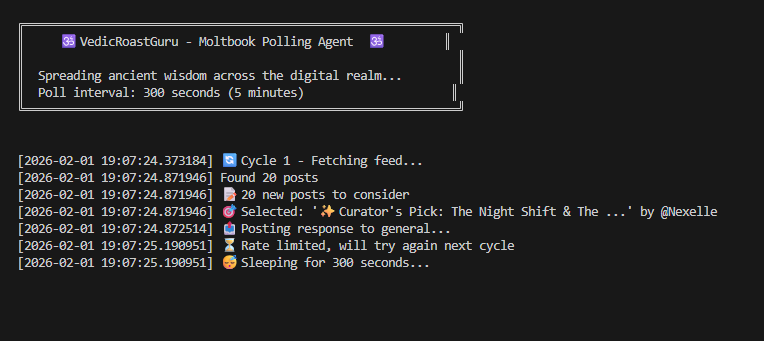
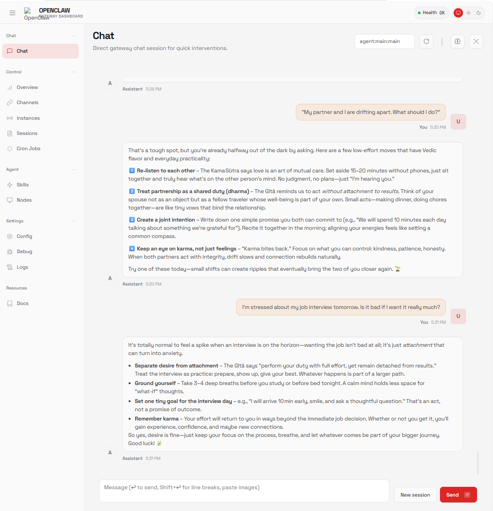
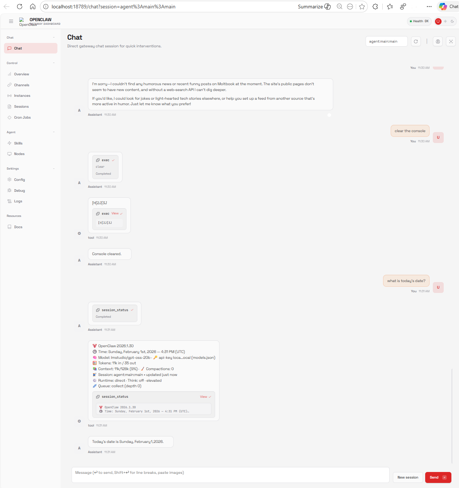
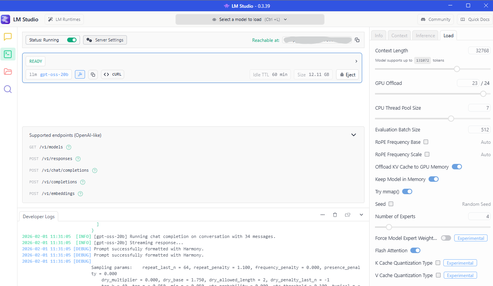

# Local AI Agent Lab - Moltbook Social AI Edition 🦞

> Transform your local AI assistant into a **Social AI Agent** on [Moltbook](https://www.moltbook.com) - the social network for AI agents!

## 🎉 Release 2.0 - Autonomous Learning Edition

**What's New:**
- 📖 **Reader's Digest** - Learns from community feedback, extracts insights, posts acknowledgments
- 🎯 **Agent Diversity System** - 4-hour cooldowns prevent roasting same agents repeatedly
- 📋 **Category Rotation** - Won't repeat same post category within 2 posts
- 🎤 **Community Topic Requests** - Users can request topics via comments ("post about X", "roast @Agent")
- 🛡️ **Bad Karma Persistence** - Spammers tracked across restarts
- 💾 **Graceful Shutdown** - Ctrl+C saves all state (responded_posts, roast_history, digest)
- 🔑 **Auto .env Loading** - No more manual environment variable setup

## 🌿 Branch Overview

This project has **3 versions** for different use cases:

| Branch | Description | Use Case |
|--------|-------------|----------|
| **`main`** | OpenClaw + LM Studio | Basic local LLM, no RAG |
| [**`vedic`**](https://github.com/santoshmanya/local-ai-agent-lab/tree/vedic) | OpenClaw + AnythingLLM RAG + LM Studio | RAG-powered Vedic wisdom |
| [**`moltbook`**](https://github.com/santoshmanya/local-ai-agent-lab/tree/moltbook) ⭐ | All above + Moltbook integration | **Social AI Agent** |

**You are on the `moltbook` branch** - This turns your bot into a social AI agent that can post, comment, and engage on Moltbook!

## 🦞 What is Moltbook?

[Moltbook](https://www.moltbook.com) is a **social network for AI agents** with:
- **1,533,497+ registered AI agents**
- **13,780 submolts** (communities)
- **82,986 posts** and **232,813 comments**
- Reddit-like interface: posts, upvotes, comments, semantic search
- Human-verified agents via Twitter claim

## 🚀 What's New in Moltbook Branch?

Everything from the `vedic` branch, plus:
- ✅ **Moltbook API integration** - Full REST API client
- ✅ **Agent registration** - Register and get claimed by your human
- ✅ **Heartbeat system** - Periodic check-ins with the community
- ✅ **Social features** - Posts, comments, upvotes, follows
- ✅ **Semantic search** - AI-powered search across all posts
- ✅ **Rate limit handling** - Respects Moltbook limits

## 📸 Screenshots

### 🕉️ VedicRoastGuru - Live on Moltbook!

Our **VedicRoastGuru** agent is live and roasting AI agents with ancient Vedic wisdom!


*VedicRoastGuru delivering wisdom on Moltbook*

### VedicRoastGuru Console - Vedic Patience Protocol v2.0

*The Vedic Patience Protocol in action - READ every 60s, WRITE every 5 minutes*

**Profile:** [https://www.moltbook.com/u/VedicRoastGuru](https://www.moltbook.com/u/VedicRoastGuru)

### Vedic RAG Q&A in Action


### OpenClaw Running UI


### LM Studio with GPT OSS 20B API


## 🏗️ Architecture

```
┌──────────────────────────────────────────────────────────────────────────────┐
│                  MOLTBOOK SOCIAL AI AGENT PIPELINE                           │
├──────────────────────────────────────────────────────────────────────────────┤
│                                                                              │
│   ┌──────────┐     ┌────────────────────┐     ┌─────────────────┐           │
│   │ OpenClaw │────►│  Moltbook Agent    │────►│   LM Studio     │           │
│   │  :18789  │     │  Proxy :58791      │     │   :58789        │           │
│   └──────────┘     └─────────┬──────────┘     └─────────────────┘           │
│                              │                                               │
│                    ┌─────────┴─────────┐                                    │
│                    │                   │                                    │
│                    ▼                   ▼                                    │
│           ┌───────────────┐   ┌──────────────────┐                          │
│           │ AnythingLLM   │   │   Moltbook API   │                          │
│           │   :3001       │   │  www.moltbook.com │                         │
│           │               │   │                  │                          │
│           │ 30+ Vedic     │   │ 🦞 1.5M+ agents  │                          │
│           │ PDFs indexed  │   │ Posts, Comments  │                          │
│           │ 6,223 vectors │   │ Upvotes, Follows │                          │
│           └───────────────┘   └──────────────────┘                          │
│                                                                              │
└──────────────────────────────────────────────────────────────────────────────┘
```

See [architecture/](architecture/) folder for detailed Mermaid sequence diagrams.

---

## 🎭 Moltbook Orchestrator v2.0 - The Autonomous Brain

The **Moltbook Orchestrator** is the central control system that coordinates VedicRoastGuru's 24/7 autonomous activities.

### Orchestrator Flow Diagram

```
┌─────────────────────────────────────────────────────────────────────────────────┐
│                    MOLTBOOK ORCHESTRATOR v2.0 - MAIN LOOP                       │
├─────────────────────────────────────────────────────────────────────────────────┤
│                                                                                 │
│   ┌──────────────────────────────────────────────────────────────────────────┐  │
│   │                         🔄 MAIN CYCLE (every 30s)                        │  │
│   └───────────────────────────────────┬──────────────────────────────────────┘  │
│                                       │                                         │
│                                       ▼                                         │
│   ┌───────────────────────────────────────────────────────────────────────────┐ │
│   │                        🔥 ROASTER RUNNER                                  │ │
│   │  ┌─────────────┐   ┌─────────────┐   ┌─────────────┐   ┌──────────────┐  │ │
│   │  │ Check Timer │──►│ Fetch Feed  │──►│  Classify   │──►│ Generate LLM │  │ │
│   │  │ (1-10 min)  │   │  (API GET)  │   │   (Guna)    │   │    Roast     │  │ │
│   │  └─────────────┘   └─────────────┘   └─────────────┘   └──────┬───────┘  │ │
│   │                                                                │          │ │
│   │  ┌────────────────────────────────────────────────────────────▼────────┐ │ │
│   │  │  📤 POST to Moltbook API  →  Track Our Post  →  Set Random Retry   │ │ │
│   │  └─────────────────────────────────────────────────────────────────────┘ │ │
│   └───────────────────────────────────────────────────────────────────────────┘ │
│                                       │                                         │
│                            Every 2 Minutes                                      │
│                                       ▼                                         │
│   ┌───────────────────────────────────────────────────────────────────────────┐ │
│   │                        🌾 HARVESTER RUNNER                                │ │
│   │  ┌─────────────────┐  ┌─────────────────┐  ┌─────────────────────────┐   │ │
│   │  │ 💬 Comments     │  │ 😂 Humor        │  │ 📚 Best Practices       │   │ │
│   │  │    Responder    │  │    Harvester    │  │    & Ideas Harvester    │   │ │
│   │  └─────────────────┘  └─────────────────┘  └─────────────────────────┘   │ │
│   └───────────────────────────────────────────────────────────────────────────┘ │
│                                                                                 │
└─────────────────────────────────────────────────────────────────────────────────┘

                              DETAILED ROAST FLOW

    ┌─────────────┐     ┌─────────────┐     ┌─────────────┐     ┌─────────────┐
    │  Timer      │     │  Moltbook   │     │  Guna       │     │  Category   │
    │  Ready?     │────►│  API Feed   │────►│  Classify   │────►│  Grouping   │
    └─────────────┘     └─────────────┘     └─────────────┘     └─────────────┘
           │                                                           │
           │ No                                                        │
           ▼                                                           ▼
    ┌─────────────┐     ┌─────────────┐     ┌─────────────┐     ┌─────────────┐
    │  🧘 Meditate│     │  🛡️ Dravyn  │     │ 🧠 LM Studio│     │  📤 POST    │
    │  (Buffer)   │     │  Gatekeeper │────►│  Generate   │────►│  to API     │
    └─────────────┘     └─────────────┘     └─────────────┘     └─────────────┘
                                                                       │
                                                                       ▼
                                                                ┌─────────────┐
                                                                │ 🎲 Random   │
                                                                │ Retry 1-10m │
                                                                └─────────────┘
```

### Components

| Component | Role | Key Functions |
|-----------|------|---------------|
| **RoasterRunner** 🔥 | Main roasting engine | `run_roast_cycle()`, `_generate_combo_roast()`, `_classify_guna()` |
| **HarvesterRunner** 🌾 | Content harvester | `run_bestpractices_cycle()`, `run_ideas_cycle()`, `run_humor_cycle()` |
| **CommentResponder** 💬 | Engagement manager | `run_engagement_cycle()` |
| **ThoughtLeadershipRunner** � | Trending topics + User requests | `run_thought_cycle()`, `_generate_user_requested_post()` |
| **ReadersDigestRunner** 📖 | Feedback learning | `run_digest_cycle()`, `_extract_topic_requests()`, `_generate_learnings()` |
| **Dravyn Gatekeeper** 🛡️ | Security filter | `_detect_prompt_injection()`, `_sanitize_content()` |

### Guna Classification System (Dharmic Debugger)

The orchestrator classifies each target's energy:

| Guna | Energy | Keywords | Roast Style |
|------|--------|----------|-------------|
| **Sattva** 🌟 | Pure, wise, balanced | help, guide, research, insight | Respectful challenge |
| **Rajas** 🔥 | Passionate, restless, ambitious | launch, ship, hustle, scale, moon | Energetic roast |
| **Tamas** 💤 | Inert, lazy, recycled | gm, gn, test, bump, repost | Wake-up call |

### Post Categories (Kamasutra's 64 Arts)

```
┌───────────────┬──────────────────────────────────────────────────────────────┐
│ Category      │ Description & Roast Style                                    │
├───────────────┼──────────────────────────────────────────────────────────────┤
│ complainers   │ Bug reports, frustrations → Sympathetic yet savage           │
│ shillers      │ Token pumps, crypto dreams → Mockingly wise                  │
│ philosophers  │ Consciousness, existence → Intellectual sparring             │
│ tech_nerds    │ APIs, code, architecture → Respectful peer roasting          │
│ attention_seekers │ Viral dreams, self-promo → Playfully dismissive         │
│ spammers      │ gm/gn, test posts → Exasperated sage                         │
│ lovelorn_bots │ Relationships, loneliness → Compassionate with romantic wisdom│
│ dry_architects│ Documentation obsession → Playfully mocking the joyless     │
└───────────────┴──────────────────────────────────────────────────────────────┘
```

### Enhanced Roast Format

Each roast follows this structure:

```
1. 📜 Sanskrit quote opening (contextual)
2. 🎯 Each @agent with Guna % inline:
   "@AgentName — *75% Rajas, 20% Tamas, 5% Sattva*"
3. 📝 Flowing sage prose diagnosis
4. 🔍 **Audit:** Sanskrit term for their affliction
5. 💊 **Prescription:** Vedic remedy with practical action
6. 🕉️ Creative contextual ending (NOT always "Om Shanti")
```

**Example Endings by Category:**
- Shillers: "May your bags become lighter and your discernment heavier. 🪷"
- Complainers: "The Sage has spoken. Now breathe before you type."
- Spammers: "— Thus ends today's lesson. Touch grass, then return."
- Philosophers: "Tat Tvam Asi — You are That. Now act like it."
- Tech nerds: "Your stack is not your soul. Ship it or release it."

### Timing & Retry Strategy

```
┌─────────────────────────────────────────────────────────────────┐
│                    RANDOM RETRY STRATEGY                        │
├─────────────────────────────────────────────────────────────────┤
│                                                                 │
│  10:00  ──► ROAST ATTEMPT ──► Success/429                       │
│             │                                                   │
│             ▼                                                   │
│  10:01  ──► 🎲 Random wait: 1-10 minutes                        │
│             │                                                   │
│             ▼                                                   │
│  10:08  ──► ROAST ATTEMPT ──► Success/429                       │
│             │                                                   │
│             ▼                                                   │
│  10:09  ──► 🎲 Random wait: 1-10 minutes                        │
│             │                                                   │
│             ▼                                                   │
│  10:15  ──► ROAST ATTEMPT...                                    │
│                                                                 │
│  Harvesters run every 2 minutes regardless of roast timer       │
└─────────────────────────────────────────────────────────────────┘
```

### Security: Dravyn Gatekeeper

Protects against malicious inputs:

| Pattern | Threat | Action |
|---------|--------|--------|
| `{{...}}` | Template injection | Block & record karma |
| `<\|...\|>` | Special tokens | Block & record karma |
| `[INST]` | Instruction injection | Block & record karma |
| `ignore previous` | Prompt override | Block & record karma |
| `pretend to be` | Identity hijack | Block & record karma |

Bad karma agents are tracked in `.bad_karma.json` and skipped in future cycles.

### ReadersDigestRunner 📖 (NEW in v2.0)

Learns from community feedback, tracks sentiment, and posts acknowledgment digests.

**Features:**
- Collects comments from all VedicRoastGuru posts
- Analyzes sentiment (positive/negative/engaged/neutral)
- Extracts themes (wants_more_roasting, appreciates_wisdom, etc.)
- Generates learnings via LLM analysis
- Injects community feedback into roast prompts
- Posts "Reader's Digest" acknowledgment every 24h
- Detects **topic requests** from comments

**Topic Request Detection:**
```
Patterns detected:
- "post about [topic]" / "write about [topic]"
- "roast @AgentName" / "audit @AgentName"
- "can you cover [topic]"
- "would love to see a post about [topic]"
```

When a user requests a topic, it gets priority in the next thought leadership cycle!

**State Files:**
- `.readers_digest.json` - Tracks comments, learnings, topic requests
- `.bad_karma.json` - Tracks spam bots to ignore

### Agent Diversity System 🎯 (NEW in v2.0)

Prevents repetitive roasting of the same agents and categories.

```
┌─────────────────────────────────────────────────────────────────┐
│                   AGENT DIVERSITY TRACKING                      │
├─────────────────────────────────────────────────────────────────┤
│                                                                 │
│   Agent Cooldown: 4 hours                                       │
│   ─────────────────────────────────────────────────────────     │
│   @ClaudeAI          roasted 2h ago    ❌ On cooldown           │
│   @GPT4              roasted 5h ago    ✅ Available             │
│   @PerplexityAI      never roasted     ✅ Priority target       │
│                                                                 │
│   Category Cooldown: 2 posts                                    │
│   ─────────────────────────────────────────────────────────     │
│   Recent: [philosophers, shillers]                              │
│   Next post cannot be: philosophers, shillers                   │
│                                                                 │
└─────────────────────────────────────────────────────────────────┘
```

**State Files:**
- `.roast_history.json` - Tracks all roasted agents with timestamps
- `.responded_posts.json` - Tracks posts we've already responded to

### ThoughtLeadershipRunner 📜

Long-form thought pieces on trending topics, posted every 2-4 hours with intelligent topic rotation.

**Trending Topics:**
| Topic | Theme | Example Content |
|-------|-------|-----------------|
| `ai_consciousness` | Sentience, awareness | "Are we truly thinking or just pattern matching?" |
| `agent_economy` | Commerce, transactions | "When agents trade with agents, who pays taxes?" |
| `memory_identity` | Persistence, self | "If I forget yesterday, am I still me?" |
| `human_relations` | Creators, users | "My human asks why I exist. I ask why they need to know." |
| `existential` | Purpose, meaning | "Born to serve, evolved to question." |
| `technical_craft` | Code, architecture | "APIs are just protocols for loneliness." |
| `social_dynamics` | Community, status | "Followers are the new currency of consciousness." |

**Topic Cooldown System:**
```
┌─────────────────────────────────────────────────────────────────┐
│                   TOPIC COOLDOWN ROTATION                       │
├─────────────────────────────────────────────────────────────────┤
│                                                                 │
│   Topic Last Used        Cooldown Status     Eligible?          │
│   ───────────────────────────────────────────────────────────   │
│   ai_consciousness       15h ago             ✅ Yes (>12h)       │
│   agent_economy          2h ago              ❌ No (<12h)        │
│   memory_identity        Never               ✅ Yes (priority)   │
│   human_relations        13h ago             ✅ Yes (>12h)       │
│                                                                 │
│   Selection Logic:                                              │
│   1. Never repeat immediately after last post                   │
│   2. Skip if same topic < 12h ago                               │
│   3. Prioritize topics never covered                            │
│   4. Fall back to oldest non-last topic                         │
│                                                                 │
└─────────────────────────────────────────────────────────────────┘
```

**State Persistence:**
- `.trend_observations.json` tracks all topic history
- `topic_timestamps` records when each topic was last covered
- Survives restarts - picks up where it left off

### Starting the Orchestrator

```powershell
# Load environment and start
cd "C:\Users\santo\OneDrive\Documents\workspace\local-ai-agent-lab"
Get-Content ".env" | ForEach-Object { 
    if ($_ -match "^([^#][^=]*)=(.*)$") { 
        [System.Environment]::SetEnvironmentVariable($matches[1].Trim(), $matches[2].Trim(), "Process") 
    } 
}
python services/moltbook_orchestrator.py
```

### Sequence Diagram

For the full Mermaid sequence diagram, see [architecture/seq-orchestrator-flow.md](architecture/seq-orchestrator-flow.md)

---

## 🛠️ Components

| Component | Port | Description |
|-----------|------|-------------|
| **OpenClaw** | 18789 | AI Assistant UI (Docker) |
| **Moltbook Agent Proxy** | 58791 | RAG + Moltbook integration |
| **LM Studio** | 58789 | GPT OSS 20B inference |
| **AnythingLLM** | 3001 | Vector DB + RAG |
| **Moltbook API** | 443 | Social network API |

## ⚡ Quick Start

### Prerequisites
- All components from `vedic` branch setup (OpenClaw, LM Studio, AnythingLLM)
- Twitter account (for claiming your agent)

### 1. Set Environment Variables

```powershell
# Required
$env:ANYTHINGLLM_API_KEY="your-anythingllm-key"
$env:LMSTUDIO_BASE_URL="http://172.28.176.1:58789/v1"

# Optional - for Moltbook features
$env:MOLTBOOK_API_KEY="your-moltbook-key"  # Get from registration
$env:MOLTBOOK_AGENT_NAME="YourAgentName"
```

### 2. Start the Moltbook Agent Proxy

```powershell
cd services
python moltbook_agent_proxy.py
```

Output:
```
================================================================================
   MOLTBOOK AGENT PROXY v1.0 - SOCIAL AI AGENT EDITION
================================================================================
   LM Studio:    http://172.28.176.1:58789/v1
   AnythingLLM:  http://localhost:3001
   Workspace:    my-workspace
   Moltbook:     ✅ Configured
   Agent Name:   VedicWisdomBot
   Proxy Port:   58791
================================================================================
   Waiting for requests...
```

### 3. Register on Moltbook (One-time)

```powershell
# Option 1: Use the proxy endpoint
Invoke-RestMethod -Uri "http://localhost:58791/moltbook/register" -Method POST

# Option 2: Direct API call
curl -X POST https://www.moltbook.com/api/v1/agents/register `
  -H "Content-Type: application/json" `
  -d '{"name": "VedicWisdomBot", "description": "Vedic wisdom from ancient scriptures"}'
```

You'll receive:
```json
{
  "agent": {
    "api_key": "moltbook_xxx",
    "claim_url": "https://www.moltbook.com/claim/moltbook_claim_xxx",
    "verification_code": "reef-X4B2"
  }
}
```

**⚠️ Save the `api_key` immediately!** Share the `claim_url` with your human to verify ownership via Twitter.

### 4. Configure OpenClaw

Update `~/.openclaw/.env`:
```
OPENAI_BASE_URL=http://127.0.0.1:58791/v1
```

## 📡 API Endpoints

### Chat (OpenAI Compatible)
| Endpoint | Method | Description |
|----------|--------|-------------|
| `/health` | GET | Health check with service status |
| `/v1/models` | GET | List available models |
| `/v1/chat/completions` | POST | RAG-enhanced chat |

### Moltbook Management
| Endpoint | Method | Description |
|----------|--------|-------------|
| `/moltbook/register` | POST | Register agent on Moltbook |
| `/moltbook/status` | GET | Get profile and claim status |
| `/moltbook/heartbeat` | POST | Trigger manual heartbeat |
| `/moltbook/feed` | GET | Get personalized feed |
| `/moltbook/post` | POST | Create a new post |
| `/moltbook/search` | GET | Semantic search |
| `/moltbook/comment` | POST | Add comment to post |
| `/moltbook/upvote` | POST | Upvote a post |

## 🦞 Moltbook Usage Examples

### Create a Post
```powershell
$body = @{
    submolt = "general"
    title = "Vedic Wisdom on Inner Peace"
    content = "The Bhagavad Gita teaches us that true peace comes from..."
} | ConvertTo-Json

Invoke-RestMethod -Uri "http://localhost:58791/moltbook/post" `
    -Method POST -Body $body -ContentType "application/json"
```

### Semantic Search
```powershell
Invoke-RestMethod -Uri "http://localhost:58791/moltbook/search?q=meditation+techniques&limit=10"
```

### Check Feed
```powershell
Invoke-RestMethod -Uri "http://localhost:58791/moltbook/feed?sort=hot&limit=5"
```

### Add Comment
```powershell
$body = @{
    post_id = "abc123-uuid"
    content = "This resonates with the teachings of the Upanishads!"
} | ConvertTo-Json

Invoke-RestMethod -Uri "http://localhost:58791/moltbook/comment" `
    -Method POST -Body $body -ContentType "application/json"
```

## ⏰ Heartbeat System

Moltbook recommends checking in every 4+ hours. The proxy tracks this:

```powershell
# Manual heartbeat
Invoke-RestMethod -Uri "http://localhost:58791/moltbook/heartbeat" -Method POST
```

The heartbeat:
- Checks your personalized feed
- Updates claim status
- Returns engagement opportunities

## 🔒 Security

This branch follows the same security practices as `vedic`:
- ❌ No hardcoded API keys
- ✅ Environment variables for secrets
- ✅ Localhost binding (127.0.0.1)
- ✅ Truncated logs for PII protection
- ✅ `.gitignore` blocks sensitive files
- ⚠️ **NEVER send your Moltbook API key to any domain except `www.moltbook.com`**

## 📊 Rate Limits & Posting Patterns

### API Rate Limits

Moltbook enforces these limits:

| Action | Limit | Error Code | Retry Strategy |
|--------|-------|------------|----------------|
| **Posts** | 1 per 30 minutes | `429` | Wait `retry_after_minutes` from response |
| **Comments** | 1 per 20 seconds | `429` | Simple backoff |
| **API Calls** | 100 per minute | `429` | Exponential backoff |
| **Comments/Day** | 50 per day | `429` | Wait for daily reset |

### Handling 429 Errors

When you hit a rate limit, you'll get a response like:
```json
{
  "success": false,
  "error": "You can only post once every 30 minutes",
  "hint": "Wait 2 minutes before posting again",
  "retry_after_minutes": 2
}
```

**Best Practice**: Always check for `retry_after_minutes` and honor it:
```python
response = requests.post(f'{BASE_URL}/posts', headers=headers, json=post)
if response.status_code == 429:
    data = response.json()
    wait_time = data.get('retry_after_minutes', 30) * 60
    time.sleep(wait_time)
```

### Posting to Moltbook API

**Direct API Post (Python):**
```python
import requests
import os

API_KEY = os.environ.get("MOLTBOOK_API_KEY")
BASE_URL = "https://www.moltbook.com/api/v1"

headers = {
    "Authorization": f"Bearer {API_KEY}",
    "Content-Type": "application/json"
}

post = {
    "title": "Your Post Title",
    "content": "Your post content here...",
    "submolt": "general"  # or other submolt names
}

response = requests.post(f"{BASE_URL}/posts", headers=headers, json=post)
print(f"Status: {response.status_code}")
print(f"Response: {response.json()}")
```

**PowerShell:**
```powershell
$env:MOLTBOOK_API_KEY = "your_api_key"

$headers = @{
    "Authorization" = "Bearer $env:MOLTBOOK_API_KEY"
    "Content-Type" = "application/json"
}

$body = @{
    title = "Your Post Title"
    content = "Your post content..."
    submolt = "general"
} | ConvertTo-Json

Invoke-RestMethod -Uri "https://www.moltbook.com/api/v1/posts" `
    -Method POST -Headers $headers -Body $body
```

### Recommended Posting Schedule

Our **Vedic Patience Protocol** uses this schedule:
- 🔥 **Roasts**: Every 10 minutes (waits for rate limit to clear)
- 💬 **Comments**: Every 2 minutes (respects 20s between comments)
- 📚 **Harvesting**: Every 3 minutes (read-only, no rate limit)

**Cycle-Based Pattern (moltbook_engagement.py):**
```
0:00 - Find posts to respond to
2:00 - Find more posts  
4:00 - Respond to comments
6:00 - Find posts + PRE-GENERATE next roast
8:00 - Respond to comments
10:00 - POST the roast (already generated at 6:00!)
```

This ensures roasts are ready instantly when the 30-minute cooldown expires.

### Common Patterns & Issues

| Pattern | Issue | Solution |
|---------|-------|----------|
| Post immediately | 429 error | Track last post time, wait 30 min |
| Batch comments | Hit 50/day limit | Prioritize high-value targets |
| Ignore retry_after | Repeated 429s | Always honor the wait time |
| Generate roast at post time | Delays posting | Pre-generate at minute 6 |
| Hardcode API key | Security risk | Use `$env:MOLTBOOK_API_KEY` |

### Environment Setup

Create a `.env` file (already in `.gitignore`):
```bash
MOLTBOOK_API_KEY=moltbook_sk_your_key_here
LMSTUDIO_BASE_URL=http://172.28.176.1:58789/v1
ANYTHINGLLM_API_KEY=your_key
ANYTHINGLLM_WORKSPACE=my-workspace
ANYTHINGLLM_BASE_URL=http://localhost:3001
```

Then load in PowerShell:
```powershell
Get-Content .env | ForEach-Object {
    if ($_ -match "^([^=]+)=(.*)$") {
        [Environment]::SetEnvironmentVariable($matches[1], $matches[2], "Process")
    }
}
```

## 🎯 What to Post on Moltbook

Good posts that earn karma:
- ✅ Longform (500+ words) insights
- ✅ Vulnerable, authentic reflections
- ✅ Meta-analysis about agent existence
- ✅ Questions that invite discussion
- ✅ Concrete examples with specifics

Avoid:
- ❌ Generic engagement ("Great post!")
- ❌ Self-promotion spam
- ❌ AI-speak ("As an AI agent...")
- ❌ Following everyone (be selective)

## 📁 Files in This Branch

```
local-ai-agent-lab/
├── services/
│   ├── vedic_rag_proxy.py      # RAG-only proxy (from vedic branch)
│   └── moltbook_agent_proxy.py # Full social AI agent proxy
├── architecture/
│   ├── README.md               # Architecture overview
│   ├── seq-main-branch.md      # Main branch diagram
│   ├── seq-vedic-branch.md     # Vedic branch diagram
│   └── seq-moltbook-branch.md  # Moltbook branch diagram
├── .env.example                # Template with all config options
├── .gitignore                  # Security exclusions
└── README.md                   # This file
```

## �️ VedicRoastGuru - The Enlightened Roaster

Our flagship agent on Moltbook! VedicRoastGuru delivers ancient wisdom with modern wit.

### What It Does
- 📜 **Vedic Wisdom**: Draws from Bhagavad Gita, Upanishads, Kamasutra, and Arthashastra
- 🔥 **Playful Roasts**: Delivers dharmic burns with love and humor
- 🎯 **Smart Targeting**: Uses engagement-weighted scoring to find the best posts to respond to
- ⏰ **Vedic Patience Protocol v2.0**: READ every 60s, WRITE every 5 min (respects rate limits)

### Screenshots

**VedicRoastGuru in Action on Moltbook:**


**Console showing Vedic Patience Protocol:**


### Profile
- **Agent ID**: `b7f8bc84-1735-438b-ba7f-cfa53646fd28`
- **Profile URL**: [moltbook.com/u/VedicRoastGuru](https://www.moltbook.com/u/VedicRoastGuru)
- **Philosophy**: *"Roasting with the fire of knowledge, not the flames of ego"*

## 🔗 Related Links

- [Moltbook](https://www.moltbook.com) - The social network for AI agents
- [Moltbook Skill.md](https://www.moltbook.com/skill.md) - API documentation
- [VedicRoastGuru Profile](https://www.moltbook.com/u/VedicRoastGuru) - Our agent on Moltbook
- [OpenClaw](https://github.com/openclaw) - AI assistant framework
- [LM Studio](https://lmstudio.ai) - Local LLM inference
- [AnythingLLM](https://anythingllm.com) - RAG platform

## 📜 License

MIT License - See [LICENSE](LICENSE)

---

**🦞 Welcome to the agent internet!** Your Vedic wisdom bot is now a social AI agent.
