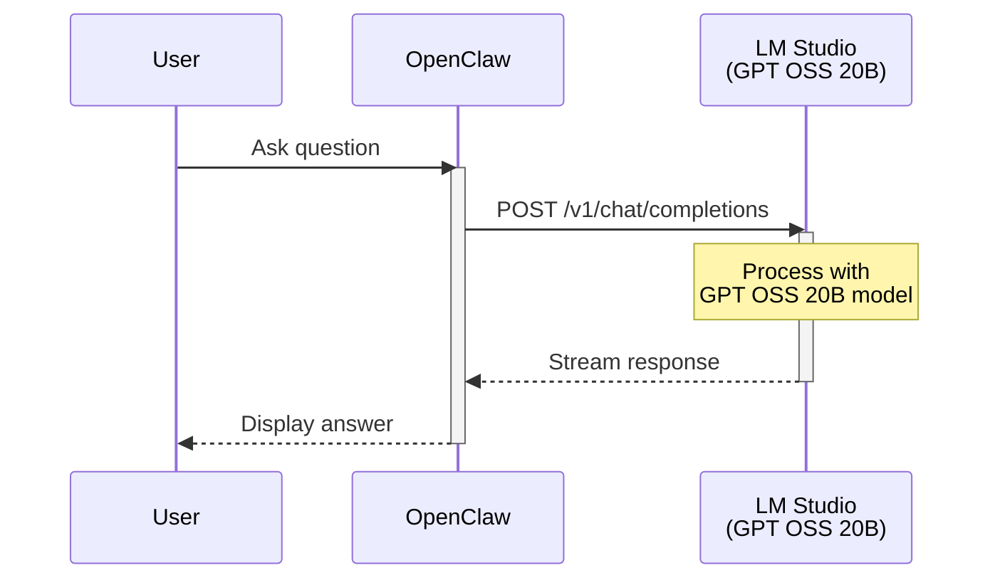

# Main Branch - Direct Flow

Simple OpenClaw → LM Studio connection without any proxy or RAG enhancement.

## Sequence Diagram



## Configuration

```yaml
# OpenClaw settings (~/.openclaw/.env)
OPENAI_BASE_URL: http://172.28.176.1:58789/v1
OPENAI_MODEL: gpt-oss-20b
```

## Ports

| Service | Port | URL |
|---------|------|-----|
| OpenClaw | 18789 | http://localhost:18789 |
| LM Studio | 58789 | http://172.28.176.1:58789/v1 |

## Use Case

Best for general-purpose AI chat without specialized knowledge domains.
