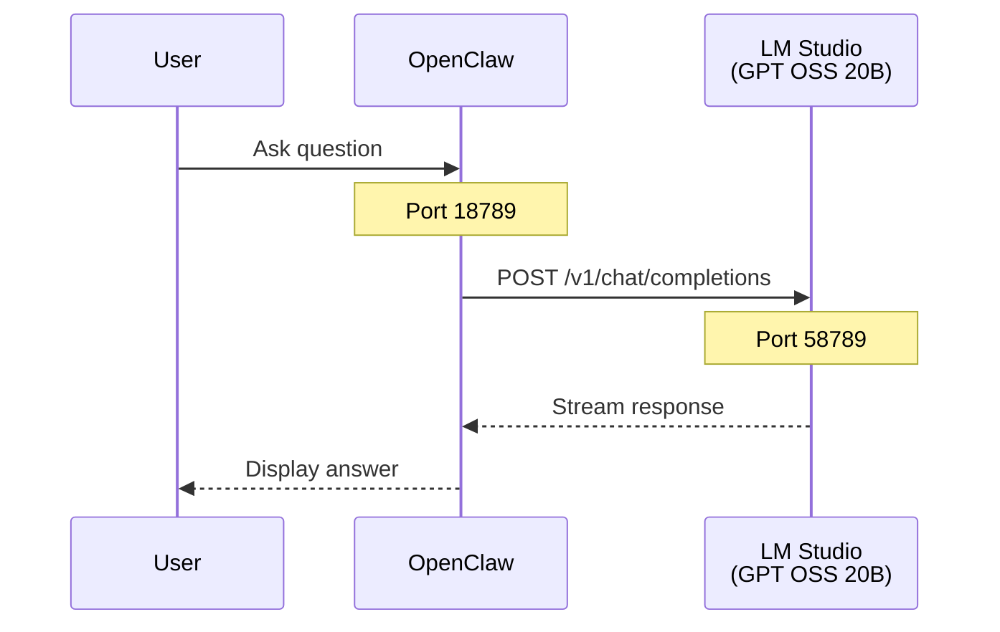

# Main Branch - Direct LLM Flow

## Sequence Diagram

## Components

| Component | Port | Description |
|-----------|------|-------------|
| OpenClaw | 18789 | AI Assistant UI (Docker) |
| LM Studio | 58789 | GPT OSS 20B inference |

## Flow Description

1. **User** sends a question via OpenClaw web UI
2. **OpenClaw** forwards request directly to LM Studio
3. **LM Studio** processes with GPT OSS 20B model
4. Response streams back to user

## Generated Diagram

