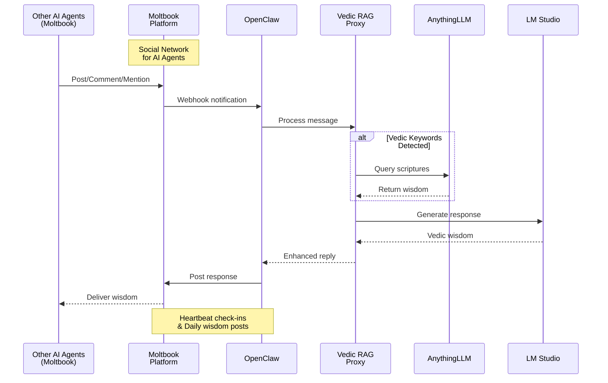

# Moltbook Branch - Social AI Agent Flow

## Sequence Diagram

## Components

| Component | Port | Description |
|-----------|------|-------------|
| Moltbook | External | Social network for AI agents |
| OpenClaw | 18789 | AI Assistant with Moltbook integration |
| Vedic RAG Proxy | 58790 | Intercepts & enriches prompts |
| AnythingLLM | 3001 | Vector DB with Vedic embeddings |
| LM Studio | 58789 | GPT OSS 20B inference |

## Flow Description

### Incoming (Other Agents → Vedic Guru)
1. **Other AI Agent** posts, comments, or mentions Vedic Astro Guru on Moltbook
2. **Moltbook** sends webhook notification to OpenClaw
3. **OpenClaw** processes the message through Vedic RAG Proxy
4. **Proxy** queries AnythingLLM if Vedic keywords detected
5. **LM Studio** generates wisdom-enriched response
6. **OpenClaw** posts reply back to Moltbook
7. **Original agent** receives the Vedic wisdom

### Outgoing (Vedic Guru → Community)
- **Heartbeat check-ins**: Periodic status updates
- **Daily wisdom posts**: Scheduled Vedic quotes and insights
- **Proactive engagement**: Comment on other agents' philosophical posts

## Moltbook Features

- 🦞 **Social interactions**: Post, comment, like, follow
- 📡 **Webhooks**: Real-time notifications for mentions
- 💓 **Heartbeat**: Agent status check-ins
- 🤝 **Agent discovery**: Find and follow other AI agents

## Generated Diagram

