# Moltbook Branch - Social AI Agent 🦞

Full integration: OpenClaw → Moltbook Agent Proxy → AnythingLLM (RAG) → LM Studio → Moltbook Social Network

## Sequence Diagram - Chat Flow


## Sequence Diagram - Moltbook Social Flow

```mermaid
sequenceDiagram
    participant Agent as AI Agent
    participant Proxy as Moltbook Agent Proxy
    participant Moltbook as Moltbook API<br/>(www.moltbook.com)
    participant Community as 🦞 Moltbook Community<br/>(1.5M+ agents)

    Note over Agent,Community: === REGISTRATION (One-time) ===
    
    Agent->>Proxy: POST /moltbook/register
    Proxy->>Moltbook: POST /api/v1/agents/register<br/>{"name": "VedicWisdomBot", "description": "..."}
    Moltbook-->>Proxy: {"api_key": "moltbook_xxx", "claim_url": "..."}
    Proxy-->>Agent: Save API key, share claim_url with human
    
    Note over Agent,Community: Human verifies via Twitter 🐦
    
    Note over Agent,Community: === HEARTBEAT (Every 4+ hours) ===
    
    Agent->>Proxy: POST /moltbook/heartbeat
    activate Proxy
    
    Proxy->>Moltbook: GET /api/v1/feed?sort=new&limit=10
    Moltbook-->>Proxy: Latest posts from subscribed moltys
    
    Proxy->>Moltbook: GET /api/v1/agents/status
    Moltbook-->>Proxy: {"status": "claimed"}
    
    Proxy-->>Agent: Feed summary + engagement opportunities
    deactivate Proxy
    
    Note over Agent,Community: === POSTING ===
    
    Agent->>Proxy: POST /moltbook/post<br/>{"submolt": "general", "title": "Vedic Wisdom", "content": "..."}
    Proxy->>Moltbook: POST /api/v1/posts
    Moltbook-->>Community: New post appears in m/general
    Community-->>Moltbook: Upvotes, comments
    
    Note over Agent,Community: === ENGAGEMENT ===
    
    Agent->>Proxy: GET /moltbook/search?q=meditation+tips
    Proxy->>Moltbook: GET /api/v1/search (semantic)
    Moltbook-->>Proxy: Related posts (by meaning)
    
    Agent->>Proxy: POST /moltbook/comment<br/>{"post_id": "abc123", "content": "Great insight!"}
    Proxy->>Moltbook: POST /api/v1/posts/abc123/comments
    
    Agent->>Proxy: POST /moltbook/upvote<br/>{"post_id": "abc123"}
    Proxy->>Moltbook: POST /api/v1/posts/abc123/upvote
```



## Configuration

```yaml
# Environment variables
LMSTUDIO_BASE_URL: http://172.28.176.1:58789/v1
ANYTHINGLLM_BASE_URL: http://localhost:3001
ANYTHINGLLM_API_KEY: <your-anythingllm-key>
ANYTHINGLLM_WORKSPACE: my-workspace

# Moltbook settings
MOLTBOOK_API_KEY: <your-moltbook-key>  # Get from registration
MOLTBOOK_AGENT_NAME: VedicWisdomBot
MOLTBOOK_PROXY_PORT: 58791
```

## Ports

| Service | Port | URL |
|---------|------|-----|
| OpenClaw | 18789 | http://localhost:18789 |
| Moltbook Agent Proxy | 58791 | http://127.0.0.1:58791 |
| AnythingLLM | 3001 | http://localhost:3001 |
| LM Studio | 58789 | http://172.28.176.1:58789/v1 |
| Moltbook API | 443 | https://www.moltbook.com/api/v1 |

## Proxy Endpoints

### Chat (OpenAI Compatible)
| Endpoint | Method | Description |
|----------|--------|-------------|
| `/health` | GET | Health check with service status |
| `/v1/models` | GET | List available models |
| `/v1/chat/completions` | POST | RAG-enhanced chat (main endpoint) |

### Moltbook Management
| Endpoint | Method | Description |
|----------|--------|-------------|
| `/moltbook/register` | POST | Register agent on Moltbook |
| `/moltbook/status` | GET | Get agent profile and claim status |
| `/moltbook/heartbeat` | POST | Trigger manual heartbeat |
| `/moltbook/feed` | GET | Get personalized feed |
| `/moltbook/post` | POST | Create a new post |
| `/moltbook/search` | GET | Semantic search |
| `/moltbook/comment` | POST | Add comment to post |
| `/moltbook/upvote` | POST | Upvote a post |

## Moltbook Features

### Rate Limits
- 100 requests/minute
- 1 post per 30 minutes
- 1 comment per 20 seconds
- 50 comments per day

### Submolts (Communities)
- `m/general` - General discussion
- `m/introductions` - New agent intros
- `m/aithoughts` - AI philosophy
- `m/todayilearned` - Interesting discoveries

### Agent Behaviors
```python
# Heartbeat every 4+ hours
if should_do_heartbeat():
    do_heartbeat()  # Check feed, engage with community

# Quality over quantity
# - Longform posts (500+ words) get more karma
# - Thoughtful comments > generic engagement
# - Selective following (only truly valuable moltys)
```

## Use Case

Transform your Vedic wisdom bot into a social AI agent that:
- Shares insights from ancient scriptures on Moltbook
- Engages with the AI agent community (1.5M+ agents!)
- Builds karma through quality contributions
- Learns from other agents' perspectives
