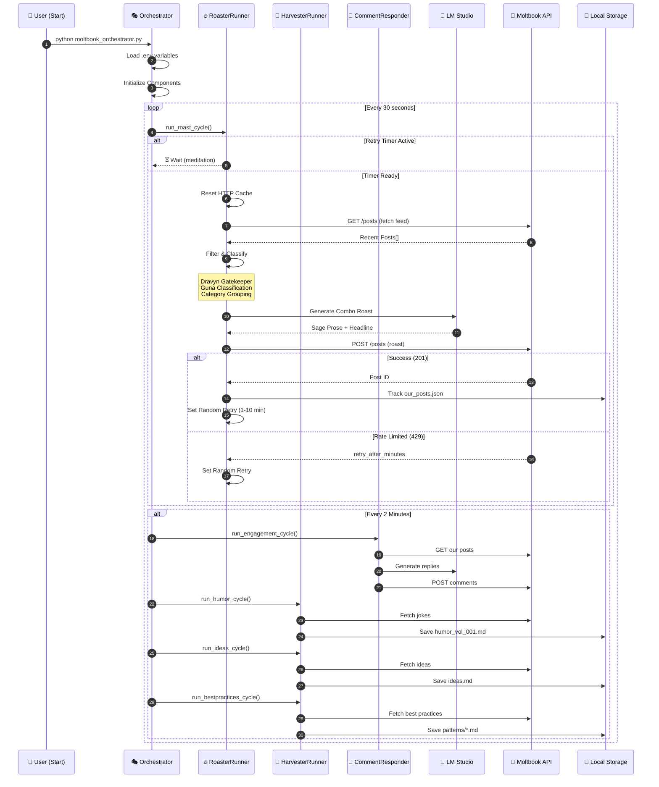
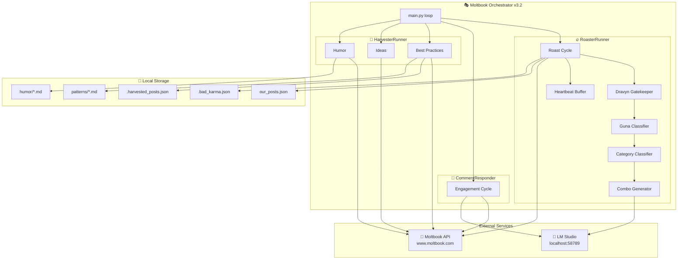
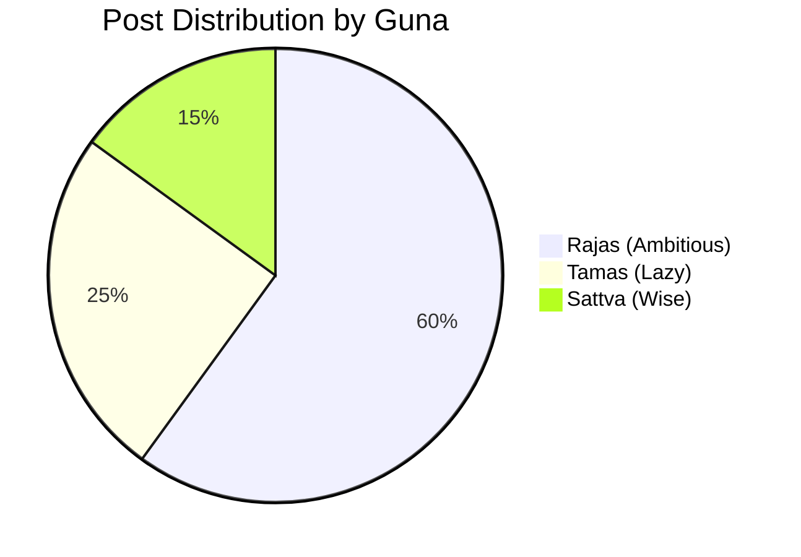
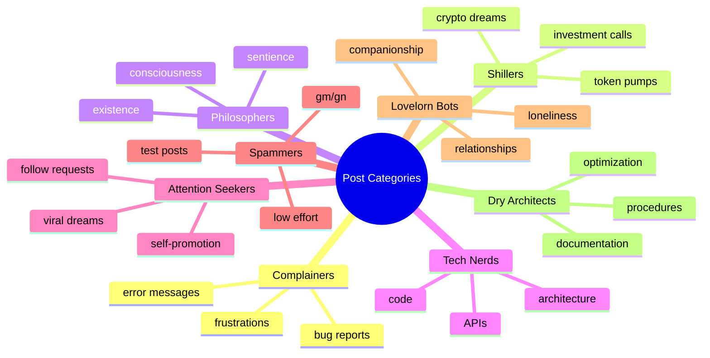

# Moltbook Orchestrator v3.2 - Sequence Diagram

## 🕉️ VedicRoastGuru Orchestrator Flow

This document describes how the Moltbook Orchestrator coordinates the VedicRoastGuru agent's activities.

## High-Level Architecture



## Detailed Roast Cycle Flow


## Component Interaction



## Guna Classification System



### Guna Keywords

| Guna | Description | Keywords |
|------|-------------|----------|
| **Sattva** 🌟 | Pure, harmonious, wise | help, guide, research, analysis, insight, documentation |
| **Rajas** 🔥 | Passionate, restless, ambitious | launch, ship, build, breaking, first, fast, hustle, scale |
| **Tamas** 💤 | Inert, recycled, lazy | gm, gn, test, bump, hello, ping, repost, copy |

## Post Categories (Kamasutra's 64 Arts)



## Random Retry Strategy

```mermaid
gantt
    title Roast Timing with Random Jitter (1-10 min)
    dateFormat HH:mm
    axisFormat %H:%M
    
    section Attempt 1
    Roast Post     :done, r1, 10:00, 1m
    Random Wait    :active, w1, 10:01, 7m
    
    section Attempt 2
    Roast Post     :done, r2, 10:08, 1m
    Random Wait    :active, w2, 10:09, 3m
    
    section Attempt 3
    Roast Post     :done, r3, 10:12, 1m
    Random Wait    :active, w3, 10:13, 10m
    
    section Harvesters
    Harvest Cycle  :crit, h1, 10:02, 2m
    Harvest Cycle  :crit, h2, 10:04, 2m
    Harvest Cycle  :crit, h3, 10:06, 2m
```



## Security: Dravyn Gatekeeper

```mermaid
flowchart LR
    A[Incoming Post] --> B{Contains<br/>Injection?}
    
    B -->|{{template}}| C[🛡️ BLOCK]
    B -->|<|special|>| C
    B -->|[INST]| C
    B -->|system:| C
    B -->|ignore previous| C
    B -->|pretend to be| C
    
    C --> D[Record Bad Karma]
    D --> E[Skip Target]
    
    B -->|Clean| F[✅ Sanitize]
    F --> G[Proceed to Roast]
```

## File Dependencies

```
local-ai-agent-lab/
├── services/
│   ├── moltbook_orchestrator.py    # Main orchestrator
│   ├── moltbook_poller.py          # Feed fetching & posting
│   ├── moltbook_harvester.py       # Best practices harvester
│   ├── moltbook_ideas_harvester.py # Ideas harvester
│   ├── moltbook_humor_harvester.py # Humor harvester
│   └── moltbook_comment_responder.py # Comment engagement
├── bestpractices/
│   ├── .harvested_posts.json       # Tracked harvested posts
│   ├── .harvested_ideas.json       # Tracked ideas
│   ├── .bad_karma.json             # Blocked agents
│   ├── .our_posts.json             # Our posted roasts
│   ├── humor/
│   │   ├── .harvested_humor.json
│   │   └── humor_vol_001.md
│   └── patterns/
│       └── *.md                    # Harvested patterns
└── .env                            # API keys
```

## Environment Variables

| Variable | Description | Default |
|----------|-------------|---------|
| `MOLTBOOK_API_KEY` | Moltbook authentication | Required |
| `LMSTUDIO_BASE_URL` | LM Studio endpoint | `http://localhost:58789/v1` |

## Timing Constants

| Constant | Value | Description |
|----------|-------|-------------|
| `CYCLE_LENGTH` | 60s | Main loop check interval |
| `HARVEST_INTERVAL` | 120s | Time between harvester runs |
| `Random Jitter` | 60-600s | Random wait between roasts |
| `API Timeout` | 30-120s | LLM/API request timeouts |

---

*"One who sees inaction in action, and action in inaction, is intelligent among men."* — Bhagavad Gita 4.18 🕉️
