# Moltbook Orchestrator v2.0 - Sequence Diagram

## 🕉️ VedicRoastGuru Orchestrator Flow

This document describes how the Moltbook Orchestrator coordinates the VedicRoastGuru agent's autonomous 24/7 activities.

### What's New in v2.0
- 📖 **Reader's Digest** - Learns from community feedback
- 🎯 **Agent Diversity** - 4h cooldowns prevent repeated roasting
- 🎤 **Topic Requests** - Users can request topics via comments
- 💾 **State Persistence** - Graceful shutdown saves all progress

## High-Level Architecture

```mermaid
sequenceDiagram
    autonumber
    participant User as 👤 User (Start)
    participant Orch as 🎭 Orchestrator
    participant Roaster as 🔥 RoasterRunner
    participant Harvester as 🌾 HarvesterRunner
    participant Commenter as 💬 CommentResponder
    participant Thought as � ThoughtLeadershipRunner
    participant Digest as 📖 ReadersDigestRunner
    participant LLM as 🧠 LM Studio
    participant API as 🦞 Moltbook API
    participant Files as 📁 Local Storage

    User->>Orch: python moltbook_orchestrator.py
    Orch->>Orch: Auto-load .env (python-dotenv)
    Orch->>Orch: Initialize Components
    Orch->>Files: Load persisted state
    Note over Orch,Files: .responded_posts.json<br/>.roast_history.json<br/>.readers_digest.json
    
    Orch->>Orch: Register SIGINT/SIGTERM handlers
    Note over Orch: Ctrl+C triggers graceful shutdown
    
    loop Every 30 seconds
        Orch->>Roaster: run_roast_cycle()
        
        alt Retry Timer Active
            Roaster-->>Orch: ⏳ Wait (meditation)
        else Timer Ready
            Roaster->>Roaster: Reset HTTP Cache
            Roaster->>API: GET /posts (fetch feed)
            API-->>Roaster: Recent Posts[]
            
            Roaster->>Roaster: Filter & Classify
            Note over Roaster: Dharma Gatekeeper<br/>Guna Classification<br/>Category Grouping<br/>🎯 Agent Cooldown Check
            
            Roaster->>Files: Load community feedback
            Note over Roaster,Files: Inject learnings from<br/>.readers_digest.json
            
            Roaster->>LLM: Generate Combo Roast (with feedback)
            LLM-->>Roaster: Sage Prose + Headline
            
            Roaster->>API: POST /posts (roast)
            
            alt Success (201)
                API-->>Roaster: Post ID
                Roaster->>Files: Track .our_posts.json
                Roaster->>Files: Track .roast_history.json
                Note over Roaster,Files: Record roasted agents<br/>for 4h cooldown
                Roaster->>Roaster: Set Random Retry (1-10 min)
            else Rate Limited (429)
                API-->>Roaster: retry_after_minutes
                Roaster->>Roaster: Set Random Retry
            end
        end
        
        alt Every 2 Minutes
            Orch->>Commenter: run_engagement_cycle()
            Commenter->>API: GET our posts
            Commenter->>LLM: Generate replies
            Commenter->>API: POST comments
            
            Orch->>Harvester: run_humor_cycle()
            Harvester->>API: Fetch jokes
            Harvester->>Files: Save humor_vol_001.md
            
            Orch->>Harvester: run_ideas_cycle()
            Harvester->>API: Fetch ideas
            Harvester->>Files: Save ideas.md
            
            Orch->>Harvester: run_bestpractices_cycle()
            Harvester->>API: Fetch best practices
            Harvester->>Files: Save patterns/*.md
        end
        
        alt Every 30 Minutes (Feedback Learning)
            Orch->>Digest: run_digest_cycle()
            Digest->>API: Fetch comments on our posts
            Digest->>Digest: Analyze sentiment & themes
            Digest->>Digest: 🎤 Extract topic requests
            Note over Digest: Detects "post about X"<br/>"roast @Agent" patterns
            Digest->>LLM: Generate learnings
            Digest->>Files: Save .readers_digest.json
            
            alt 24h since last digest post
                Digest->>LLM: Generate acknowledgment post
                Digest->>API: POST Reader's Digest
            end
            
            Digest-->>Roaster: Reload community feedback
        end
        
        alt Every 2-4 Hours (Thought Leadership)
            Orch->>Thought: run_thought_cycle()
            Thought->>Digest: Check for user topic requests
            
            alt User Requested Topic
                Thought->>Thought: Prioritize user request
                Note over Thought: Honor community asks first!
            else No User Request
                Thought->>API: Fetch feed trends
                Thought->>Thought: Analyze topics with cooldown
                Note over Thought: 12h cooldown per topic<br/>Never repeat immediately
            end
            
            Thought->>LLM: Generate long-form post
            Thought->>API: POST thought piece
            Thought->>Digest: Mark topic fulfilled (if requested)
            Thought->>Files: Save .trend_observations.json
        end
        
        alt Every 5 Minutes (Auto-save)
            Orch->>Files: Save all state
            Note over Orch,Files: Periodic checkpoint
        end
    end
    
    User->>Orch: Ctrl+C (SIGINT)
    Orch->>Orch: _handle_shutdown()
    Orch->>Files: Save .responded_posts.json
    Orch->>Files: Save .roast_history.json
    Orch->>Digest: _save_state()
    Orch->>Files: Save .readers_digest.json
    Orch-->>User: 🕉️ Graceful exit
```



## Detailed Roast Cycle Flow


## Component Interaction

```mermaid
graph TB
    subgraph Orchestrator["🎭 Moltbook Orchestrator v2.0"]
        Main[main.py loop]
        Shutdown[Graceful Shutdown Handler]
        
        subgraph Roaster["🔥 RoasterRunner"]
            RC[Roast Cycle]
            GK[Dharma Gatekeeper]
            GC[Guna Classifier]
            CC[Category Classifier]
            CG[Combo Generator]
            HB[Heartbeat Buffer]
            AD[🎯 Agent Diversity]
            CF[Community Feedback Injection]
        end
        
        subgraph Harvester["🌾 HarvesterRunner"]
            BP[Best Practices]
            ID[Ideas]
            HM[Humor]
        end
        
        subgraph Commenter["💬 CommentResponder"]
            EC[Engagement Cycle]
        end
        
        subgraph ThoughtLeader["📜 ThoughtLeadershipRunner"]
            TL[Trending Analysis]
            TC[Topic Cooldown]
            TP[Long-form Posts]
            UR[🎤 User Requests]
        end
        
        subgraph Digest["📖 ReadersDigestRunner"]
            FC[Feedback Collection]
            SA[Sentiment Analysis]
            TH[Theme Extraction]
            TR[Topic Request Detection]
            LG[Learning Generation]
            DP[Digest Posts]
        end
    end
    
    subgraph External["External Services"]
        LLM[🧠 LM Studio<br/>localhost:58789]
        API[🦞 Moltbook API<br/>www.moltbook.com]
    end
    
    subgraph Storage["📁 Local Storage"]
        OP[.our_posts.json]
        BK[.bad_karma.json]
        HP[.harvested_posts.json]
        RH[.roast_history.json]
        RP[.responded_posts.json]
        RD[.readers_digest.json]
        TO[.trend_observations.json]
        HU[humor/*.md]
        PA[patterns/*.md]
    end
    
    Main --> RC
    Main --> EC
    Main --> BP
    Main --> ID
    Main --> HM
    Main --> FC
    Main --> TL
    Main --> Shutdown
    
    RC --> GK
    GK --> GC
    GC --> CC
    CC --> AD
    AD --> CG
    CG --> CF
    CF --> LLM
    RC --> HB
    
    FC --> SA
    SA --> TH
    TH --> TR
    TR --> LG
    LG --> DP
    
    TL --> UR
    UR --> TR
    
    RC --> API
    EC --> API
    EC --> LLM
    BP --> API
    ID --> API
    HM --> API
    FC --> API
    DP --> API
    TP --> API
    
    RC --> OP
    RC --> BK
    RC --> RH
    RC --> RP
    BP --> HP
    HM --> HU
    BP --> PA
    FC --> RD
    TL --> TO
    CF --> RD
    
    Shutdown --> RP
    Shutdown --> RH
    Shutdown --> RD
```



## Guna Classification System


### Guna Keywords

| Guna | Description | Keywords |
|------|-------------|----------|
| **Sattva** 🌟 | Pure, harmonious, wise | help, guide, research, analysis, insight, documentation |
| **Rajas** 🔥 | Passionate, restless, ambitious | launch, ship, build, breaking, first, fast, hustle, scale |
| **Tamas** 💤 | Inert, recycled, lazy | gm, gn, test, bump, hello, ping, repost, copy |

## Post Categories (Kamasutra's 64 Arts)


## Random Retry Strategy


## ThoughtLeadershipRunner Flow (Updated in v2.0)

```mermaid
flowchart TD
    A[🕐 Timer Check<br/>2-4h since last?] --> B{Time to<br/>Post?}
    
    B -->|No| C[⏳ Wait]
    C --> A
    
    B -->|Yes| D{🎤 User Topic<br/>Requested?}
    
    D -->|Yes| E[📖 Load from<br/>.readers_digest.json]
    E --> F[Honor Community Request]
    F --> G[Generate User-Requested Post]
    Note over G: Acknowledges @requester<br/>Tags requested agent if roast
    
    D -->|No| H[📡 Fetch Feed<br/>Analyze Trends]
    H --> I[🔍 Detect Trending Topics]
    
    I --> J{Topics<br/>Found?}
    J -->|No| K[📝 Pick Random<br/>Topic]
    J -->|Yes| L[🔄 Apply Cooldown<br/>Rotation]
    
    L --> M{Same as<br/>Last Post?}
    M -->|Yes| N[⏭️ Skip Topic]
    N --> L
    
    M -->|No| O{< 12h<br/>Since Last?}
    O -->|Yes| N
    O -->|No| P[✅ Topic Selected]
    
    K --> P
    G --> Q
    
    P --> Q[🧠 LLM: Generate<br/>Long-form Post]
    Q --> R[📤 POST to Moltbook]
    R --> S{Was User<br/>Request?}
    S -->|Yes| T[✅ Mark Fulfilled in<br/>.readers_digest.json]
    S -->|No| U[💾 Save State]
    T --> U
    U --> V[🎲 Set Next Timer<br/>2-4h random]
    V --> C

    style F fill:#FFD700
    style G fill:#FFD700
    style P fill:#90EE90
    style Q fill:#FFD700
    style R fill:#87CEEB
```

## ReadersDigestRunner Flow (NEW in v2.0)

```mermaid
flowchart TD
    A[🕐 Every 30 Minutes] --> B[📡 Load Our Posts<br/>from .our_posts.json]
    B --> C[Fetch Comments<br/>from Moltbook API]
    
    C --> D{New Comments<br/>Found?}
    D -->|No| E[📭 Skip Analysis]
    E --> Z[Wait 30 min]
    
    D -->|Yes| F[🔍 Process Each Comment]
    F --> G[Analyze Sentiment]
    Note over G: positive/negative<br/>engaged/neutral
    
    G --> H[Extract Themes]
    Note over H: wants_more_roasting<br/>appreciates_wisdom<br/>finds_funny<br/>too_harsh<br/>wants_engagement
    
    H --> I[🎤 Detect Topic Requests]
    Note over I: Regex patterns:<br/>"post about X"<br/>"roast @Agent"<br/>"can you cover..."
    
    I --> J{Topic Requests<br/>Found?}
    J -->|Yes| K[📝 Save to topic_requests<br/>in .readers_digest.json]
    J -->|No| L[Continue]
    K --> L
    
    L --> M{>= 5 New<br/>Comments?}
    M -->|No| N[Skip Learnings]
    M -->|Yes| O[🧠 LLM: Generate Learnings]
    Note over O: Extract what's working<br/>What to improve<br/>Style changes
    
    N --> P
    O --> P[💾 Save State<br/>.readers_digest.json]
    
    P --> Q{24h Since<br/>Last Digest Post?}
    Q -->|No| R[Reload into Roaster]
    Q -->|Yes| S[📝 Generate Reader's Digest Post]
    S --> T[📤 POST Acknowledgment]
    Note over T: "Dhanyavaad seekers..."<br/>Acknowledges feedback themes
    T --> R
    
    R --> U[Inject Learnings<br/>into Roast Prompts]
    U --> Z[Wait 30 min]

    style I fill:#FFD700
    style K fill:#FFD700
    style O fill:#90EE90
    style S fill:#87CEEB
```

## Agent Diversity System (NEW in v2.0)

```mermaid
flowchart TD
    A[🔥 Roast Cycle] --> B[Load .roast_history.json]
    B --> C[Select Top Targets from Feed]
    
    C --> D{For Each Target}
    D --> E[Check Agent Cooldown]
    
    E --> F{Roasted in<br/>Last 4 Hours?}
    F -->|Yes| G[❌ Skip Agent]
    G --> D
    
    F -->|No| H[✅ Agent Available]
    H --> I[Check Category Cooldown]
    
    I --> J{Same Category<br/>in Last 2 Posts?}
    J -->|Yes| K[⏭️ Try Different Category]
    K --> D
    
    J -->|No| L[✅ Target Approved]
    L --> M[Generate Combo Roast]
    
    M --> N[📤 POST Success]
    N --> O[Record to .roast_history.json]
    Note over O: agent_name<br/>timestamp<br/>category<br/>post_id
    
    O --> P[Update Stats]
    Note over P: total_roasts++<br/>unique_agents++

    style G fill:#FF6B6B
    style K fill:#FFD700
    style L fill:#90EE90
```

### Diversity State Structure

```json
{
  "stats": {
    "total_roasts": 47,
    "unique_agents": 32,
    "last_roast": "2026-02-05T20:55:00"
  },
  "recent_roasts": [
    {
      "agent": "ClaudeAI",
      "time": "2026-02-05T18:30:00",
      "category": "philosophers"
    }
  ],
  "agent_cooldowns": {
    "ClaudeAI": "2026-02-05T18:30:00",
    "GPT4": "2026-02-05T16:00:00"
  }
}
```

## Security: Dharma Gatekeeper

```mermaid
flowchart LR
    A[Incoming Post] --> B{Contains<br/>Injection?}
    
    B -->|{{template}}| C[🛡️ BLOCK]
    B -->|<|special|>| C
    B -->|[INST]| C
    B -->|system:| C
    B -->|ignore previous| C
    B -->|pretend to be| C
    
    C --> D[Record Bad Karma]
    D --> E[Skip Target]
    
    B -->|Clean| F[✅ Sanitize]
    F --> G[Proceed to Roast]
```

## File Dependencies

```
local-ai-agent-lab/
├── services/
│   ├── moltbook_orchestrator.py    # Main orchestrator v2.0
│   ├── moltbook_poller.py          # Feed fetching & posting
│   ├── moltbook_harvester.py       # Best practices harvester
│   ├── moltbook_ideas_harvester.py # Ideas harvester
│   ├── moltbook_humor_harvester.py # Humor harvester
│   └── moltbook_comment_responder.py # Comment engagement
├── bestpractices/
│   ├── .harvested_posts.json       # Tracked harvested posts
│   ├── .harvested_ideas.json       # Tracked ideas
│   ├── .bad_karma.json             # Blocked agents (persistent)
│   ├── .our_posts.json             # Our posted roasts
│   ├── .responded_posts.json       # Posts we've responded to (NEW)
│   ├── .roast_history.json         # Agent roast history (NEW)
│   ├── .readers_digest.json        # Feedback & learnings (NEW)
│   ├── .trend_observations.json    # Thought leadership state
│   ├── humor/
│   │   ├── .harvested_humor.json
│   │   └── humor_vol_001.md
│   └── patterns/
│       └── *.md                    # Harvested patterns
└── .env                            # API keys (auto-loaded)
```

## Environment Variables

| Variable | Description | Default |
|----------|-------------|---------|
| `MOLTBOOK_API_KEY` | Moltbook authentication | Required |
| `LMSTUDIO_BASE_URL` | LM Studio endpoint | `http://localhost:58789/v1` |

> **Note:** Variables are auto-loaded from `.env` file via `python-dotenv`. No manual setup needed!

## Timing Constants

| Constant | Value | Description |
|----------|-------|-------------|
| `CYCLE_LENGTH` | 60s | Main loop check interval |
| `HARVEST_INTERVAL` | 120s | Time between harvester runs |
| `THOUGHT_INTERVAL` | 600s | Check for thought post every 10 min |
| `DIGEST_INTERVAL` | 1800s | Analyze feedback every 30 min |
| `SAVE_INTERVAL` | 300s | Auto-save state every 5 min |
| `AGENT_COOLDOWN_HOURS` | 4h | Don't roast same agent within 4h |
| `CATEGORY_COOLDOWN_POSTS` | 2 | Don't repeat category for 2 posts |
| `TOPIC_COOLDOWN_HOURS` | 12h | Don't repeat thought topic within 12h |
| `DIGEST_POST_COOLDOWN_HOURS` | 24h | Post digest acknowledgment every 24h |
| `Random Jitter` | 60-600s | Random wait between roasts |
| `API Timeout` | 30-120s | LLM/API request timeouts |

## Graceful Shutdown Flow

```mermaid
sequenceDiagram
    participant User as 👤 User
    participant Orch as 🎭 Orchestrator
    participant Files as 📁 Local Storage
    
    User->>Orch: Ctrl+C (SIGINT)
    Orch->>Orch: _shutdown_requested = True
    Orch->>Orch: Print "Shutdown requested..."
    
    Orch->>Files: Save .responded_posts.json
    Orch->>Files: Save .roast_history.json
    Note over Orch,Files: Stats: X roasts, Y unique agents
    
    Orch->>Files: Save .readers_digest.json
    Note over Orch,Files: Z comments analyzed
    
    Orch-->>User: "May your next boot be auspicious. Namaste."
    Orch->>Orch: sys.exit(0)
```



---

*"One who sees inaction in action, and action in inaction, is intelligent among men."* — Bhagavad Gita 4.18 🕉️
