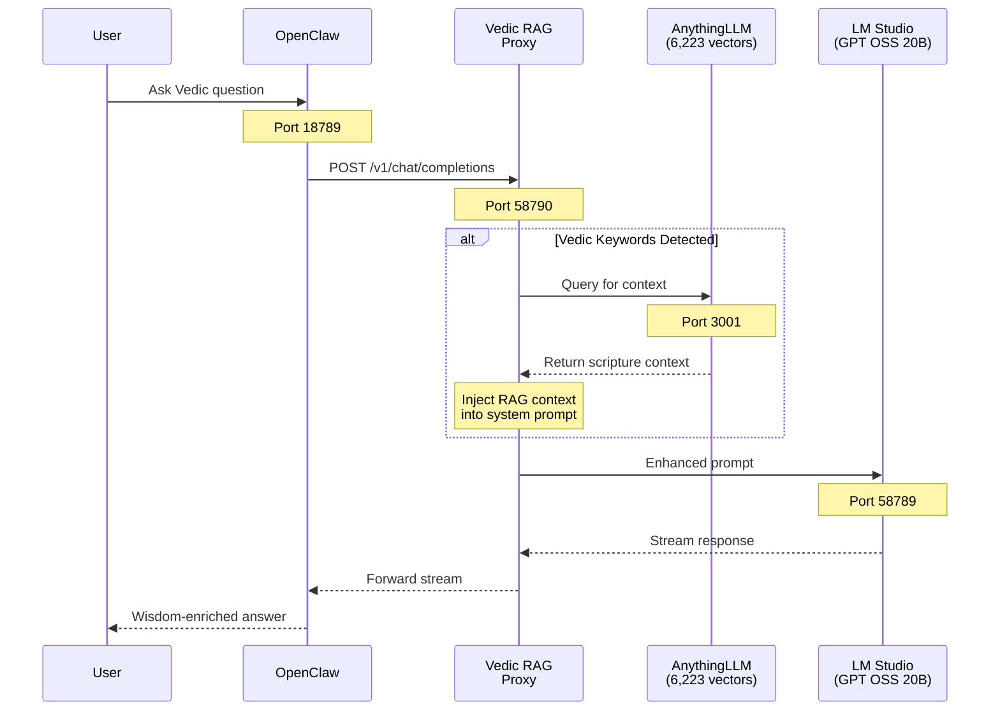

# Vedic Branch - RAG-Powered Flow ⭐

## Sequence Diagram

## Components

| Component | Port | Description |
|-----------|------|-------------|
| OpenClaw | 18789 | AI Assistant UI (Docker) |
| Vedic RAG Proxy | 58790 | Intercepts & enriches prompts |
| AnythingLLM | 3001 | Vector DB with 6,223 Vedic embeddings |
| LM Studio | 58789 | GPT OSS 20B inference |

## Flow Description

1. **User** asks a Vedic-related question via OpenClaw
2. **OpenClaw** routes to Vedic RAG Proxy (not directly to LM Studio)
3. **Proxy** detects Vedic keywords (dharma, karma, gita, relationship, etc.)
4. **Proxy** queries AnythingLLM for relevant scripture context
5. **AnythingLLM** returns matching passages from 30+ Vedic texts
6. **Proxy** injects context into system prompt
7. **LM Studio** generates response grounded in Vedic wisdom
8. Response streams back through proxy to user

## Vedic Keyword Triggers

- Relationships: `relationship`, `marriage`, `love`, `partner`
- Spirituality: `dharma`, `karma`, `soul`, `meditation`
- Scriptures: `gita`, `veda`, `purana`, `upanishad`
- Astrology: `nakshatra`, `birth star`, `horoscope`
- Life: `stressed`, `job`, `interview`, `depressed`

## Generated Diagram

