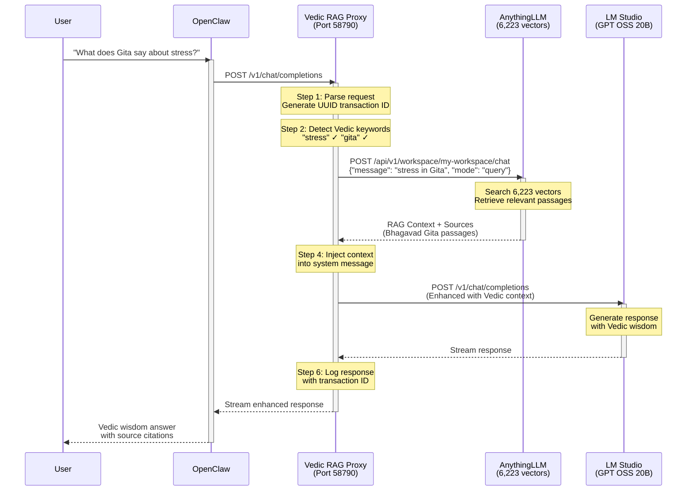

# Vedic Branch - RAG Pipeline

OpenClaw → Vedic RAG Proxy → AnythingLLM (RAG) → LM Studio

Adds Retrieval-Augmented Generation from Vedic scriptures (Gita, Vedas, Puranas, Kama Sutra).

## Sequence Diagram



## Configuration

```yaml
# Environment variables
LMSTUDIO_BASE_URL: http://172.28.176.1:58789/v1
ANYTHINGLLM_BASE_URL: http://localhost:3001
ANYTHINGLLM_API_KEY: <your-api-key>
ANYTHINGLLM_WORKSPACE: my-workspace
VEDIC_PROXY_PORT: 58790
```

## Ports

| Service | Port | URL |
|---------|------|-----|
| OpenClaw | 18789 | http://localhost:18789 |
| Vedic RAG Proxy | 58790 | http://127.0.0.1:58790 |
| AnythingLLM | 3001 | http://localhost:3001 |
| LM Studio | 58789 | http://172.28.176.1:58789/v1 |

## Vedic Keywords (Trigger RAG)

```python
VEDIC_KEYWORDS = [
    "relationship", "marriage", "love", "kama", "sutra", "dharma", "karma",
    "vedic", "gita", "bhagavad", "veda", "purana", "upanishad", "scripture",
    "spiritual", "meditation", "peace", "anger", "attachment", "duty",
    "stressed", "interview", "job", "partner", "drifting", "depressed"
]
```

## Use Case

Perfect for spiritual guidance, life advice, relationship questions, and Vedic philosophy discussions.
